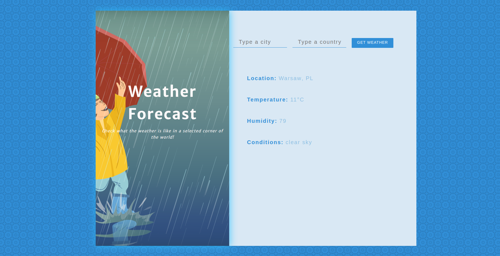

This project was bootstrapped with [Create React App](https://github.com/facebookincubator/create-react-app).

# Getting Started

Execute the following command on your terminal to install all the needed packages and run the application:
```sh
$ npm i
$ npm start
```
The application will start automatically in your browser on http://localhost:3000

# Tools

* React
* Bootstrap
    
# Screenshot




    
